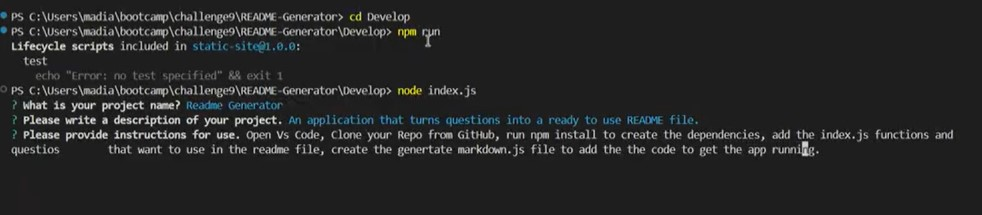
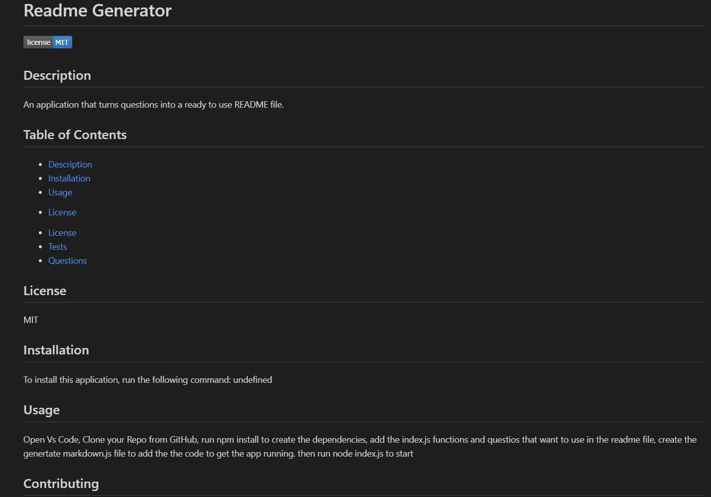

# README-Generator
## **Description**
The README Generator is a command-line application that simplifies the process of creating professional and high-quality README files. By answering prompts, users can generate a fully formatted README.md file, including sections like Description, Installation, Usage, License, Contributing, Tests, and Questions.

Below is the link to the repo
https://github.com/madybt/README-Generator

and this is the link to the video walkthrough.
https://drive.google.com/file/d/1X5SJ0r-TdjMRhmr0MEBm3UcOlvGXHgPj/view?usp=sharing

## Below are two images of the readme created and the app functioning.

